This is an unofficial implementation of [《SRGAN:Photo-Realistic Single Image Super-Resolution Using a Generative Adversarial Network》](https://arxiv.org/abs/1609.04802)。实现了4倍的超分！
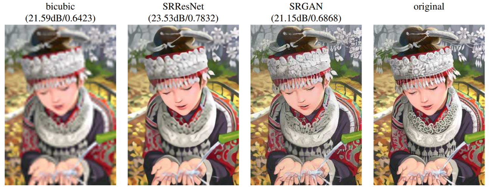
# My Environment：
pytorch==1.10.0+cu102<br>
torchaudio==0.10.0+cu102<br>
torchvision==0.11.0+cu102<br>
numpy==1.24.4<br>
pandas==2.0.3<br>
tqdm==4.66.1<br>
Pillow==10.1.0<br>
# Datasets:
[DIV2K](https://data.vision.ee.ethz.ch/cvl/DIV2K/)

目录结构:(注:我只下载了DIV2K_train_HR和DIV2K_valid_HR两个图像文件，至于低分辨率图像，我是直接通过高分辨率图像下采样得到的--不是很专业，玩一下嘛，别骂了别骂了)<br>
```
├─datasets
│  ├─DIV2K_train_HR
│  │      0001.png
│  │      0002.png
│  │      0003.png
│  │      0004.png
│  │      ......
│  └─DIV2K_valid_HR
│          0801.png
│          0802.png
│          0803.png
│          0804.png
│  │      ......
```
# Train
开始训练：<br>
```python
python main.py
```
注：没有设置命令行功能，想要更改参数，请在main.py文件中直接修改。如下：
```python
parser.add_argument('--train_dataset', default="./datasets/DIV2K_train_HR", type=str,
                    help='训练集的图片路径')
parser.add_argument('--valid_dataset', default="./datasets/DIV2K_valid_HR", type=str,
                    help='测试集的图片路径')
parser.add_argument('--upscale_factor', default=4, type=int, choices=[2, 4, 8],
                    help='用于指定超分辨率的放大因子，默认为4')
parser.add_argument('--epochs', default=100, type=int, help='总训练轮数')
parser.add_argument('--batch_size', default=16, type=int, help='批次大小，显存不足可以调小一点')
```
### 丐版训练计划：
显存不足+其他资源不足怎么办？如下更改：

#### 更改batch_size：
```python
parser.add_argument('--batch_size', default=16, type=int, help='批次大小，显存不足可以调小一点')
#16不行就8，8不行就4，再不行就2，不是吧不是吧，你这也太小了吧！`
```
#### cpu资源不足怎么办？
```python
train_loader = DataLoader(train_dataset, batch_size=args.batch_size, shuffle=True, num_workers=16, pin_memory=True, drop_last=True)
#删掉多线程num_workers等等，变成如下
train_loader = DataLoader(train_dataset, batch_size=args.batch_size, shuffle=True)
#其他的DataLoader也是如此
```
#### 减少模型参数：可以考虑删掉几层卷积或者减小特征通道，懂得都懂嗷！

#### 节约时间：
```python
parser.add_argument('--epochs', default=100, type=int, help='总训练轮数')
#那就少训练几轮呗
```

#### 图像大小：
```python
transform = transforms.Compose([
            transforms.Resize(400),
            transforms.CenterCrop(400),#显存不足就缩小图像尺寸，400是Resize高分辨率图像
            transforms.ToTensor()    #400太大就200，200太大就100，100不行就88，不会吧不会吧，这么小的哇！
])
```
#### 训练和验证的各项指标变化：
PSNR：平均峰值信噪比(MSE越小，则PSNR越大；所以PSNR越大，代表着图像质量越好。)；SSIM：平均结构相似度指数(0-1之间，1说明两张图一模一样)。
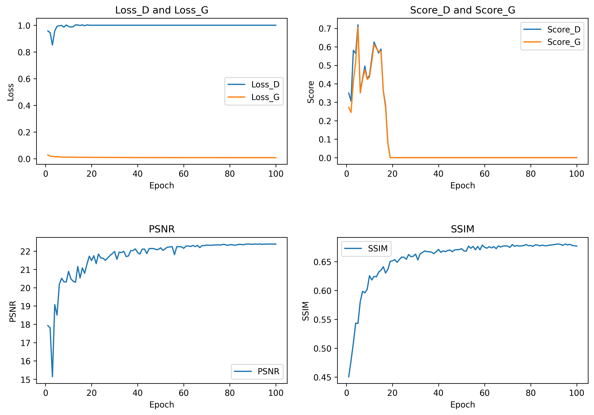

# Test
开始测试：<br>
```python
python test.py
```
我的测试集和验证集是一样的，没办法，不专业嘛！不同的地方是，训练期间的验证集是跟训练集一样Resize(400)然后再进行各个指标的评估；测试阶段并没有进行Resize操作，直接输入原图HR，下采样4倍LR，在输入模型输出Fake_HR,然后对(Fake_HR,原图HR)进行各项指标的评估。当然原图尺寸大，对显存和资源要求高，请参考上文丐版训练计划，要么我说啊,就别测试了，玩玩demo不香嘛。
#### 测试指标变化：
一共99张图片，每张图片的PSNR和SSIM。
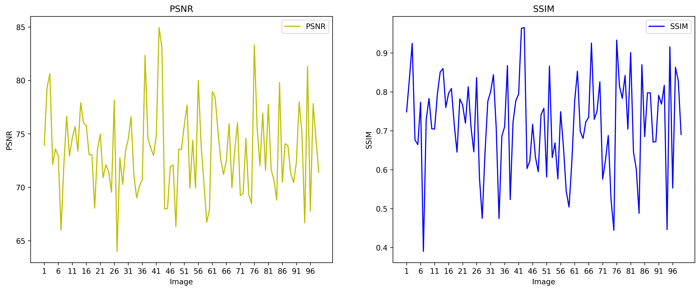

|  平均指标   | PSNR  | SSIM |
|:-------:|:-----:|:----:|
| Average | 73.40 | 0.72 |

# Demo
```python
python demo.py
```
注：模型参数和图片我都上传了，可以玩一玩，感谢二次元朋友亲情图片贡献！<br>
<p float="left">
  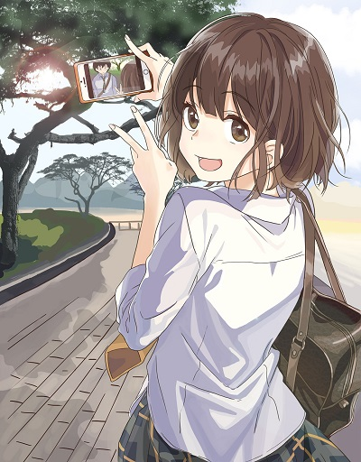
  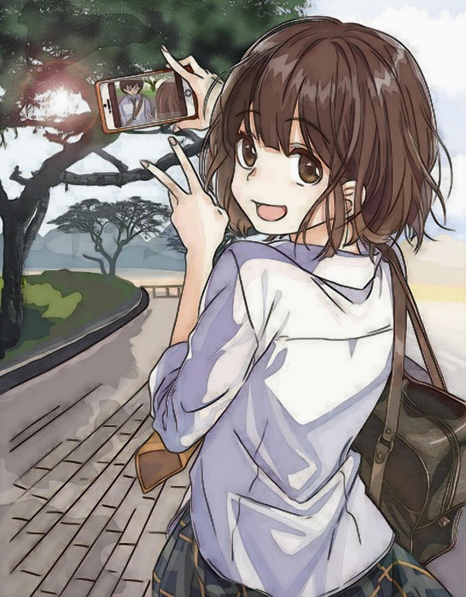 
</p>
<p float="left">
  <em style="padding-left: 100px;">左分辨率: 400×512</em>
  <em style="padding-left: 200px;">->右分辨率: 1600×2048</em>
</p>

<p float="left">
  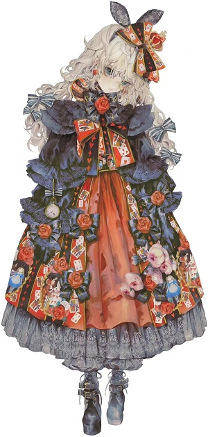
  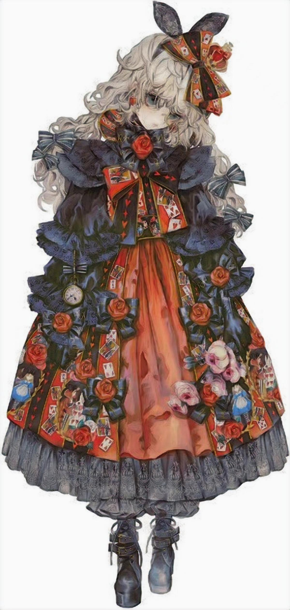 
</p>
<p float="left">
  <em style="padding-left: 100px;">左分辨率: 300×629</em>
  <em style="padding-left: 200px;">->右分辨率: 1200×2516</em>
</p>

<p float="left">
  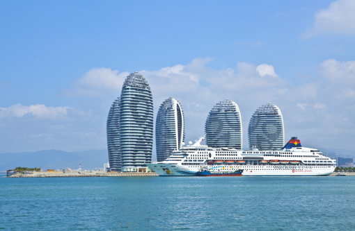
  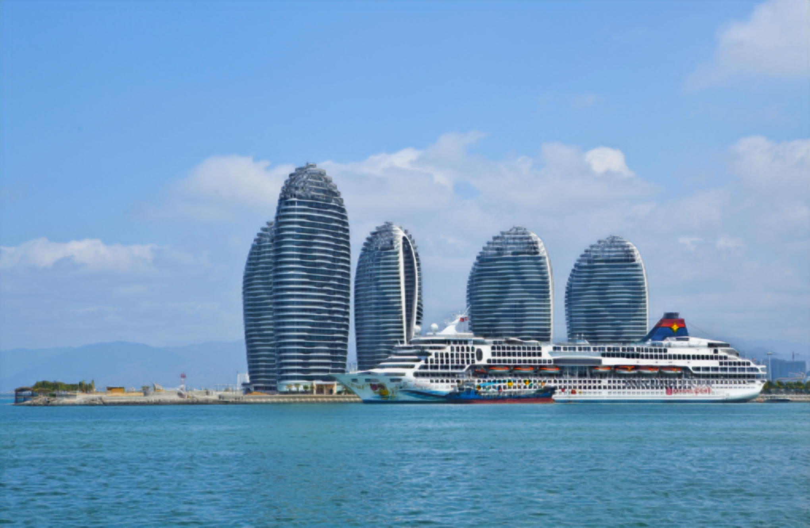 
</p>
<p float="left">
  <em style="padding-left: 100px;">左分辨率: 510×333</em>
  <em style="padding-left: 200px;">->右分辨率: 2040×1332</em>
</p>

<p float="left">
  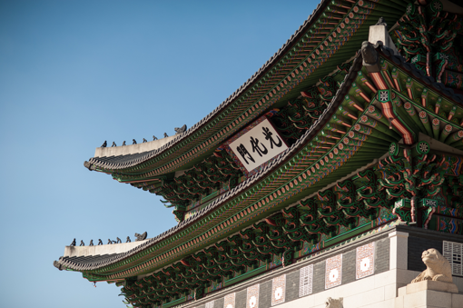
  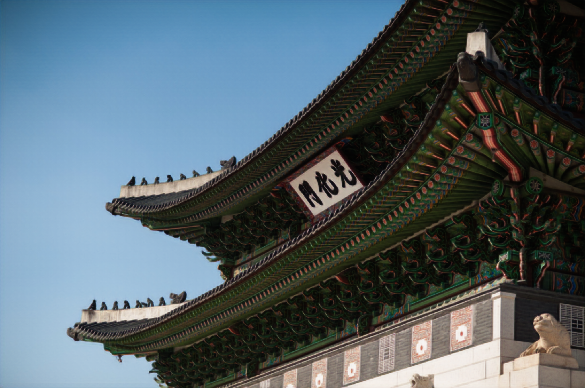 
</p>
<p float="left">
  <em style="padding-left: 100px;">左分辨率: 510×339</em>
  <em style="padding-left: 200px;">->右分辨率: 2040×1356</em>
</p>


# Conclusion
若要实现其他倍数，也可进行1、2、3等其他倍数的训练。

优点：图像SR最广泛使用的优化目标是MSE，许多最先进的方法依赖于此。 然而，在实现特别高的PSNR的同时，MSE优化问题的解决方案通常缺乏高频内容，
这导致具有过度平滑纹理的感知上不满意的解决方案。论文提出了SRGAN，这是一个基于GAN的网络，针对新的感知损失进行了优化。
作者用基于VGG网络深度提取的特征图（激活层之后的）计算的损耗替换基于MSE的内容丢失，这对于像素空间的变化更加不变。此外，为了区分真实的HR图像和生成的SR样本， 
作者还训练了一个鉴别器。

缺点：<br>
1，作者在SRGAN网络中添加了许多BN层，BN层在训练期间使用batch中的均值和方差对特征进行规范化，在测试期间使用整个训练集的均值和方差。
在训练数据和测试数据差异很大时，BN层会引入伪影，限制模型的泛化能力。<br>
2，激活特征稀少，激活前的特征包含的信息更多，如下图所示。激活后使用特征会导致重建亮度与地面真实图像不一致。
该图出自[《ESRGAN: Enhanced Super-Resolution Generative Adversarial Networks》](https://arxiv.org/pdf/1809.00219v2.pdf)
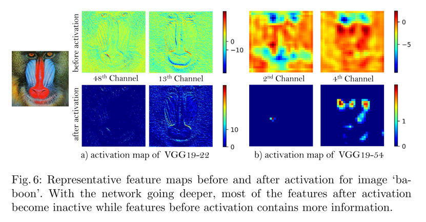


# 完结撒花！